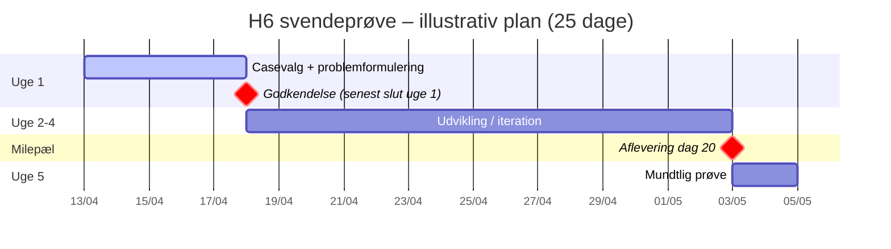

# Tidsplan og Gantt

Standardforløbet er **25 dage** over **5 uger**. Her er den overordnede logik – tilpas **datoer** til dit holds kalender.

## Uge for uge

### Uge 1

**Dag 1 og frem**

- Vælg **case** (indmeldt fra virksomhed el.lign.).
- Lav **problemformulering** med struktur som i en **kravspecifikation**.
- Lav **estimeret tidsplan i Gantt-format** (eller tilsvarende tydelig tidslinje – fx Sheets/Excel/GitHub Projects – se nedenfor).
- **Begge dele skal godkendes senest ved udgangen af uge 1** — den estimerede Gantt er **ikke** valgfri i forhold til godkendelsen.

### Uge 2, 3 og 4

- Primært **udvikling** mod den godkendte plan og krav.

### Dag 20 (milepæl)

**Fuld aflevering** af blandt andet:

- Case  
- **Logbog** med **estimeret og realiseret** tidsplan (fra dag 1)  
- **Produktrapport**  
- **Procesrapport**  
- **Kildekode** (fx via GitHub)

### Uge 5

- **Mundtlig svendeprøve** for holdet: typisk **1–2 dage** afhængigt af holdstørrelse.
- **45 minutter** per gruppe/elev i lokalet med **votering** fra **2 undervisere og censor**.

---

## Interaktiv tidslinje (Mermaid)

Nedenfor er et **illustrativt Gantt-diagram**. Ret **startdato** (`planstart`) eller brug det som skabelon i [projektplanlægning-skabelonen](../skabelon-proces/01-projektplanlaegning.md).

!!! note "Tilpas datoer"

    **Mermaid** skal have en **rigtig startdato**. Skift `2026-04-13` til jeres **første H6-dag** og lad `duration` (5 + 15 dage + milepæle) følge kalenderen. Hvis skemaet ikke er sammenhængende kalenderdage, brug i stedet **Google Sheets / Excel** til det endelige Gantt og læg det i bilag.

### Alternativer til Gantt (som i jeres materiale)

- **Google Sheets** – [skabelon (åbn og kopiér)](https://docs.google.com/spreadsheets/d/11JD5ipsuegJpUKMD-xMBLY9sB1zk3csFMJk9_VtHyyI/edit?usp=sharing)  
- **Excel** – [Microsoft Gantt-skabeloner](https://create.microsoft.com/en-us/templates/gantt-charts)  
- **GitHub Projects** – [Roadmap / timeline-view](https://docs.github.com/en/issues/planning-and-tracking-with-projects/customizing-views-in-your-project/customizing-the-roadmap-layout)  

Du kan **eksportere** eller **screenshot** dit Gantt og lægge det i bilag til procesrapporten.

---

## Udskrift

Diagrammer bygget med Mermaid vises i browseren. Ved **Udskrift → PDF**: brug evt. browsers mulighed for at fange hele siden, eller eksportér Gantt fra Sheets/Excel for pænere papirlayout.
