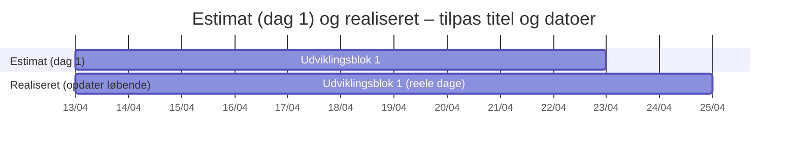

# Projektplanlægning

!!! info "Procesrapport vs. uge 1"

    **MAGS’ procesrapport** består af **projektplanlægning**, **logbog** og **konklusion**.  
    **Problemformulering** og **kravspecifikation** arbejder I med i **uge 1** og i **case** – det er **ikke** et separat kapitel i denne procesrapport-skabelon.

    Den **estimerede Gantt** (eller tilsvarende tidslinje), som skal **godkendes senest uge 1** sammen med øvrige uge-1-leverancer, dokumenterer I **her** som første del af procesrapporten.

---

## Estimeret Gantt til godkendelse (uge 1) {#estimeret-gantt-til-godkendelse-uge-1}

Dette afsnit skal indeholde den **estimerede tidsplan i Gantt-format** (eller Google Sheet / Excel / GitHub Projects **timeline**, hvis det svarer til et Gantt-lignende overblik), som skal være **godkendt ved udgangen af uge 1**.

[Indsæt screenshot, PDF eller billede af det godkendte Gantt-estimat fra uge 1 — eller indlejr filen under docs/bilag og link hertil]

### Godkendelse af Gantt-estimatet

!!! note "Uge 1"

    Beskriv **hvordan og hvornår** den **estimerede** plan blev **godkendt**: dato, vejleder, evt. ændringer i milepæle efter feedback.

    Hvis godkendelsen skete **samme gang** som andre uge-1-leverancer (fx problemformulering ved vejleder), kan du **kort** nævne det — uden at skrive hele problemformuleringen om i procesrapporten.

[Dato, kort proces, evt. ændringer efter feedback på tidsplanen]

---

## Realiseret plan og afvigelser

Når projektet skrider frem, fører I den **realiserede** tidsplan sammen med det, I estimerede **dag 1**.

### Tabellskitse (estimat fra uge 1 vs. realiseret)

| Aktivitet | Estimeret start | Estimeret slut | Realiseret start | Realiseret slut | Afvigelse – hvorfor? |
|-----------|-----------------|----------------|------------------|-----------------|----------------------|
| […] | | | | | |

---

## Interaktiv Gantt (Mermaid, valgfrit)

Herunder kan I **kopiere** et Mermaid-diagram til websitet — det erstatter **ikke** kravet om et rigtigt Gantt i uge 1, med mindre I også bruger det som jeres officielle estimat.

**Kopiér og tilpas** — skift **startdato** og opgavenavne så det matcher jeres **logbog**.

!!! tip "To spor side om side"

    Mermaid kan vise **estimat** og **realiseret** som **parallelle** opgaver i samme diagram, eller I laver **to separate** diagrammer.

---

## Værktøj og kilde

| Værktøj | Link / note |
|---------|-------------|
| Google Sheets | [Mercantec-skabelon](https://docs.google.com/spreadsheets/d/11JD5ipsuegJpUKMD-xMBLY9sB1zk3csFMJk9_VtHyyI/edit?usp=sharing) |
| Excel | [Microsoft Gantt-skabeloner](https://create.microsoft.com/en-us/templates/gantt-charts) |
| GitHub Projects | [Roadmap layout](https://docs.github.com/en/issues/planning-and-tracking-with-projects/customizing-views-in-your-project/customizing-the-roadmap-layout) |

[Hvad brugte I til Gantt — og hvorfor?]

## Risiko og ændringer undervejs

[Henvis til logbog for detaljer – opsummer de største ændringer i planen]
